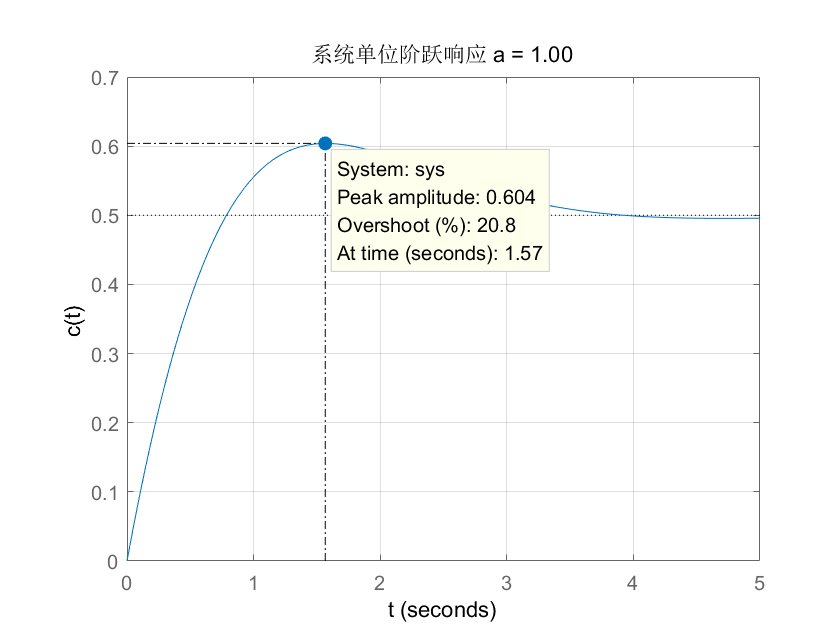
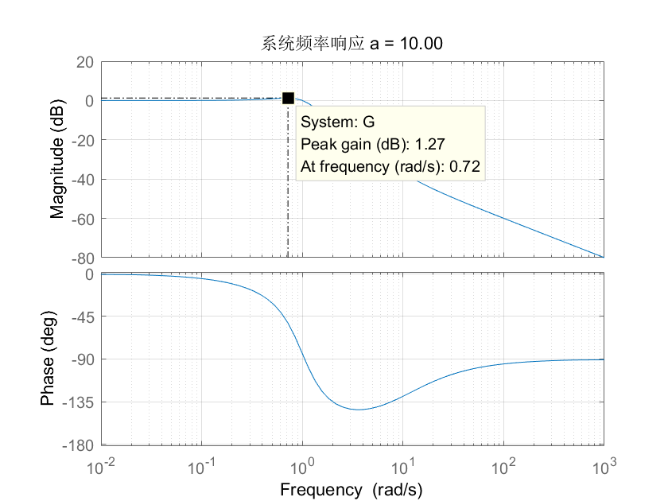
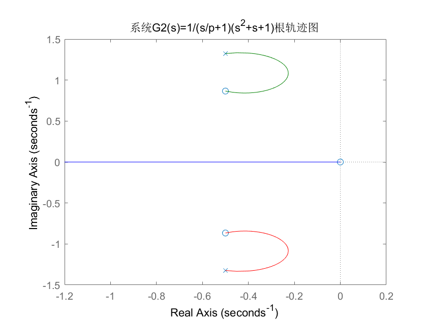
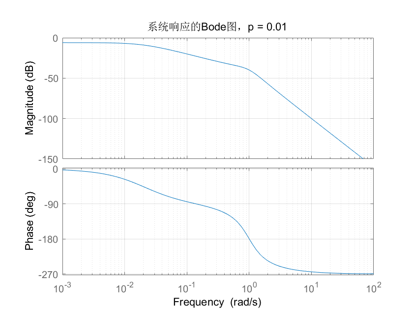
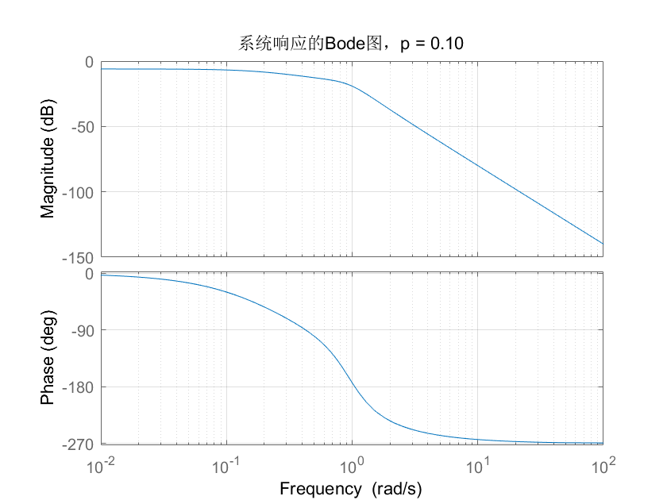
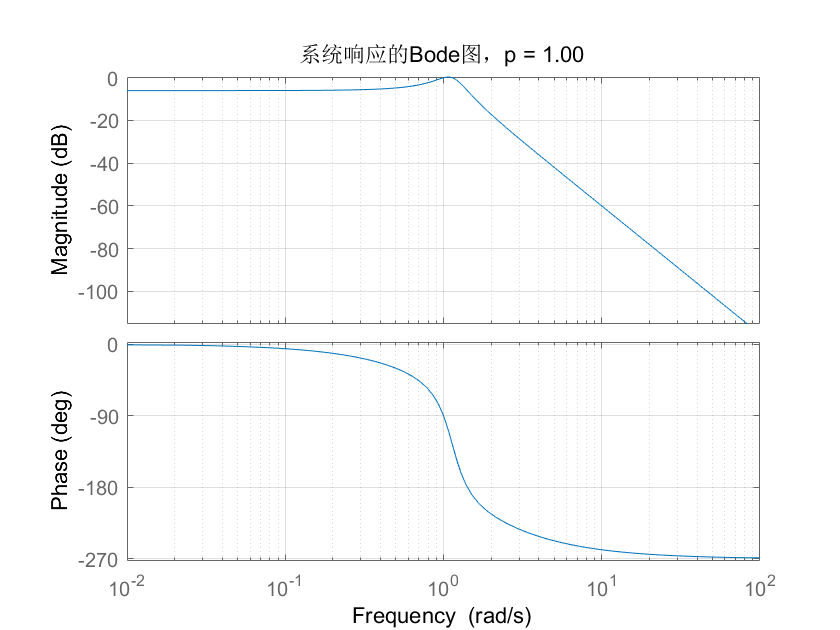
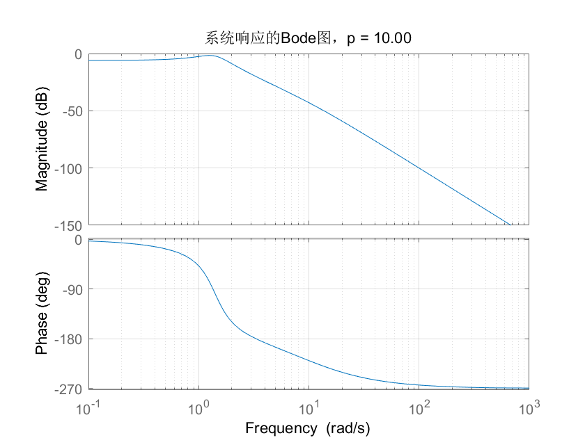

### 零极点对系统性能的影响

计64	嵇天颖	2016010308

计64    秦笑容    2016011337

---

[TOC]

---

#### 一、实验目的

通过分析改变系统开环传递函数的零极点并分析对应的系统性能，从而得到系统性 能与传递函数零极点的关系。 

#### 二、实验要求

1. 实验假设条件 

系统开环传递函数为：$G_1$=$\frac{s/a+1}{s^2+s+1}$或$G_2$=$\frac{1}{(s/p+1)(s^2+s+1)}$,其中$G_1$是在阻尼系数𝜉=0.5的归一化二阶系统的传递函数上增加了 一个零点得到的，$G_2$是在阻尼系数𝜉=0.5的归一化二阶系统的传递函 数上增加了一个极点得到的。

2. 实验任务     

- 当开环传递函数为$G_1$时，绘制系统的根轨迹和奈奎斯特曲线；    
- 当开环传递函数为$G_1$时，𝑎分别取 0.01，0.1，1，10，100 时， 用 Matlab 计算系统阶跃响应的超调量和系统频率响应的谐振峰值，并分析 两者的关系；     
- 画出(2)中各𝑎值的波特图；     
- 当开环传递函数为$G_2$时，绘制系统的根轨迹和奈奎斯特曲线；    
- 当开环传递函数为$G_2$时，𝑝分别取 0.01，0.1，1，10，100 时， 绘制不同𝑝值时的波特图； 
- 对比增加极点后系统带宽和原二阶系统的带宽，分析增加极点对系统带宽的影响； 

- 用 Matlab 画出上述每种情况的单位阶跃输入的响应。 

#### 三、实验内容

##### 【任务1】

1. 当开环传递函数为`G1(s)`时，绘制系统的根轨迹和奈奎斯特曲线

取`a = 1`

* 根轨迹曲线：

~~~matlab
k = 1; %开环增益
a = 1; 
num = [1/a 1];
den = [1 1 1];
[p,z] = pzmap(num,den);
G = zpk(z,p,k);
rlocus(G); 
title('系统G1(s)=(s/a+1)/(s^2+s+1)根轨迹图');
~~~

* 奈奎斯特曲线

~~~matlab
%G1,a= 1,奈奎斯特曲线
k = 1; %开环增益
a = 1; 
num = [1/a 1];
den = [1 1 1];
nyquist(num,den);
title('G1(s)= (s/a+1)/(s^2+s+1)的奈奎斯特曲线');
~~~

##### 【任务2】【任务3】

2. 当开环传递函数为`G1(s)`时, `a`分别取 `0.01，0.1，1，10，100` 时，用 `Matlab `计算系统阶跃响应的超调量和系统频率响应的谐振峰值，并分析 两者的关系；

3. 画出2中各个`a`值对应的波特图

$$
开环传递函数G(s) = \frac{s/a+1}{s^2+s+1}\\
闭环传递函数M(s) = \frac{s/a+1}{s^2+(1/a+1)s+2}
$$

* 系统阶跃响应

~~~matlab
% a = 0.01,0.1,1,10,100
a = 0.01;
num=[1/a,1]
den=[1,1/a+1,2]
step(num,den)
grid on
xlabel('t'),ylabel('c(t)')
title(sprintf('系统响应 a = %.2f',a));
~~~

* 系统频域响应

~~~matlab
% a = 0.01,0.1,1,10,100
a = 0.01;
num=[1/a,1] % num = [1/a,1]
den=[1,1,1] 
G=tf(num,den)                       
bode(G) 
grid on
title(sprintf('系统频率响应 a = %.2f',a));
~~~

* a = 0.01

$$
系统单位阶跃响应最大值y_m = 0.989\\
系统单位阶跃响应超调量\sigma= \frac{y_m-y_s}{y_s}=97.9\%
$$

​		
$$
系统的谐振峰值是M_r = 40dB
$$

* a = 0.1

  

$$
系统单位阶跃响应最大值y_m = 0.89\\
系统单位阶跃响应超调量\sigma= \frac{y_m-y_s}{y_s}=78.1\%
$$

$$
系统的谐振峰值是M_r = 20dB
$$

* a = 1

$$
系统单位阶跃响应最大值y_m = 0.604\\
系统单位阶跃响应超调量\sigma= \frac{y_m-y_s}{y_s}=20.8\%
$$

$$
系统的谐振峰值是M_r = 3.33dB
$$

* a = 10

  
  $$
  系统单位阶跃响应最大值y_m = 0.634\\
  系统单位阶跃响应超调量\sigma= \frac{y_m-y_s}{y_s}=26.8\%
  $$

$$
系统的谐振峰值是M_r = 1.27dB
$$

* a = 100

$$
系统单位阶跃响应最大值y_m = 0.65\\
系统单位阶跃响应稳态值y_s = 0.5\\
系统单位阶跃响应超调量\sigma= \frac{y_m-y_s}{y_s}=\frac{0.65-0.5}{0.5}=0.3
$$

$$
系统的谐振峰值是M_r = 1.25dB
$$

* 原归一化二阶系统闭环传递函数
  $$
  M(s)=\frac{1}{s^2+s+2}
  $$

  ~~~c++
  num = [1];
  den = [1,1,2];
  step(num,den);
  grid on
  xlabel('t')
  ylabel('c(t)') 
  title('原归一化二阶系统M(s)=1/(s^2+s+2)的单位阶跃响应')
  ~~~

  

$$
系统单位阶跃响应最大值y_m = 0.652\\
系统单位阶跃响应超调量\sigma= \frac{y_m-y_s}{y_s}=30.5\%
$$

* 关系分析

  | a          | 超调量 | 谐振峰值 |
  | ---------- | ------ | -------- |
  | 原二阶系统 |        |          |
  | 0.01       |        |          |
  | 0.1        |        |          |
  | 1          |        |          |
  | 10         |        |          |
  | 100        |        |          |
  |            |        |          |

（1）当Mr增大时，&sigma;也相应增大。因为增加对零点系统稳态值不产生影响。当a=0.01  时，Mr=40，&sigma;=97.9%， 随着a的增大，Mr开始减小，&sigma;也减小，直到a减小到某值时达到最小，&sigma;也不再减小；a继续增大，Mr减小到零，&sigma;也增大，当a增大到100时，&sigma;=30.5%，Mr=1.25dB，越来越接近于原二阶系统的值。

（2）附加零点对系统的影响：首先相应变快，上升时间tr减小，其次，振荡趋势加剧，超调量变大。

（3）由此可知，零点离虚轴越近，对系统暂态性影响越大，零点离虚轴越远，对系统的影响越小。因此，若附加的零点远离虚轴，可忽略它对系统的影响，按原二阶系统处理。

##### 【任务4】

4. 当开环传递函数为G2(s)时，绘制系统的根轨迹和奈奎斯特曲线

开环传递函数
$$
G_2(s)= \frac{1}{(s/p+1)(s^2+s+1)}
$$
对应的闭环特征方程为
$$
D_c(s)= (s/p+1)(s^2+s+1)+1 = 0
$$
恒等变换为
$$
\frac{\frac{1}{p}(s^3+s^2+s)}{s^2+s+2}+1= 0
$$
因此开环传递函数
$$
G(s)=\frac{\frac{1}{p}(s^3+s^2+s)}{s^2+s+2}
$$
的根轨迹图就是原系统的根轨迹图

* 根轨迹图

~~~matlab
num = [1,1,1,0];
den = [1,1,2];
G = tf(num,den);
rlocus(G);
title('系统G1(s)=1/(s/p+1)(s^2+s+1)根轨迹图');
~~~

* 奈奎斯特曲线图

  ~~~matlab
  num = [1,1,1,0];
  den = [1,1,2];
  G = tf(num,den);
  nyquist(G);
  title('系统G2(s)=1/(s/p+1)(s^2+s+1)的奈奎斯特曲线');
  ~~~

  

##### 【任务5】

5. 当开环传递函数为`G2(s)`时, `p`分别取 `0.01，0.1，1，10，100` 时，画出各个`p`值对应的波特图

系统的闭环传递函数
$$
M(s)=\frac{G_2(s)}{1+G_2(s)}=\frac{1}{s^3/p+(1/p+1)s^2+(1/p+1)s+2}
$$

~~~matlab
%G2
%p = 0.01,0.1,1,10,100
p = 0.01;
num=[1];
den=[1/p,1/p+1,1/p+1,2];
G = tf(num,den);
bode(G);
grid on
xlabel('t');
ylabel('c(t)');
title(sprintf('系统响应的Bode图，p = %.2f',p));
~~~

* p = 0.01

* p = 0.1

* p = 1

* p = 10

* p = 100

##### 【任务6】

6. 对比增加绩点后系统带宽和原二级系统的带宽，分析增加极点对系统带宽的影响

原系统

| p      | 带宽频率Wb | 带宽（0，Wb） | 截止频率&omega;c | 相位裕度&gamma; |
| ------ | --------------------- | ------------------------ | --------------------------- | --------------- |
| 0.01   | 0.010                 | （0,0.0101）             | 0                           | -180            |
| 0.1    | 0.102                 | （0,0.101）              | 0                           | -180            |
| 1      | 0.995                 | （0，1）                 | 0.0087                      | 179             |
| 10     | 1.27                  | （0,1.27）               | 0.9947                      | 84.9272         |
| 100    | 1.27                  | （0,1.27）               | 0.9999                      | 89.4337         |
| 原系统 | 1.27                  | (0,1.27)                 | 1.00                        | 90              |

（1）当`p`增大时，系统的带宽频率Wb不断增大，由`p=0.01`时，Wb=0.01， 增加到`p=100`时，Wb=1.27。即当极点离虚轴很近(`p=0.01`)时，系统的带宽频率很小，与原系统相差很大，当极点远离虚轴（`p=100`）时，带宽频率与原系统相同。

（2）附加极点对系统的影响：首先系统响应变慢，上升时间tr增加，其次，振荡趋势减弱，超调量变小，其总的效果相当于使原来典型二阶系统中的阻尼系数变大。

（3）增加极点会使系统截止频率减小，随着极点离虚轴距离的增加，截止频率不断靠近原系统的截止频率。

（4）因此，增加的极点离虚轴越近，对系统暂态性能影响越大，增加的极点离虚轴越远，对系统的影响越小。故，若附加的极点离虚轴很远，可忽略它对系统的影响，按原二阶系统处理。

##### 【任务7】

7. 用`Matlab`画出上述每种情况的单位阶跃输入的响应

* p = 0.01

* p = 0.1

* p = 1

* p = 10

* p = 100

* 原二阶系统

  

#### 四、实验结论

 由上述实验我们可以得到如下两点结论:

1、增加零点时，会增加系统响应的超调量，带宽增大，当零点实部远大于原二阶系统阻尼系数时，附加零点对系统的影响减小，所以当零点远离虚轴时，零点对系
统的影响变小，当其离虚轴的距离达到一定值时，可忽略其对系统性能的影响。 
2、增加极点时，系统超调量减小，调整时间 s t 增大，极点离虚轴越近，当系统影响越大，极点离虚轴越远，对系统性能的影响越小，当极点实部远大于原二阶系统阻尼系数时，附加极点对系统的影响可以忽略。 

#### 五、文件目录

~~~c++
卷 OS 的文件夹 PATH 列表
卷序列号为 8AD1-3414
C:.
│  list.txt				//文件目录列表
│  README.md			//git-readme
│  
├─figs					//效果图
│      g1gen.png
│      g1nei.png
│      g1_0.01_bode.png
│      g1_0.01_response.png
│      g1_0.1_bode.png
│      g1_0.1_response.png
│      g1_1.00_bode.png
│      g1_1.00_response.png
│      g1_10.00_bode.png
│      g1_10.00_response.png
│      g1_100.00_response.png
│      g1_100_bode.png
│      g1_origin_step.png
│      g2_0.01_bode.png
│      g2_0.01_step.png
│      g2_0.1_bode.png
│      g2_0.1_step.png
│      g2_1.00_bode.png
│      g2_1.00_step.png
│      g2_10.00_bode.png
│      g2_100.00_bode.png
│      g2_100_step.png
│      g2_10_step.png
│      g2_nyquist.png
│      g2_origin_bode.png
│      g2_root.png
│      
├─report				//实验报告
│      report.md
│      
└─src					//源码
        g1_bode.m				//G1波特图
        G1_nyquist.m			//G1奈奎斯特曲线	
        g1_origin_step.m		//G1原二阶系统单位阶跃响应
        G1_rootLocus.m			//G1根轨迹
        g1_step.m				//G1附加零点单位阶跃响应
        G2_Bode.m				//G2波特图
        G2_nyquist.m			//G2奈奎斯特曲线
        g2_origin_bode.m		//G1原二阶系统波特图
        G2_rootLocus.m			//G2根轨迹
        g2_step.m				//G2附加极点单位阶跃响应
~~~

#### 六、实验感想

通过本次实验，我们结合了理论分析与实验数据，进一步验证了关于零极点对
系统性能影响的一些理论，大大加深了我们对于这些理论知识的理解，实验与理论的相互验证使得我们对于书本知识的可信度大大加强，也巩固了对书本相应知识的学习结果。最后感谢助教及老师对于我们实验的指导和帮助！ 