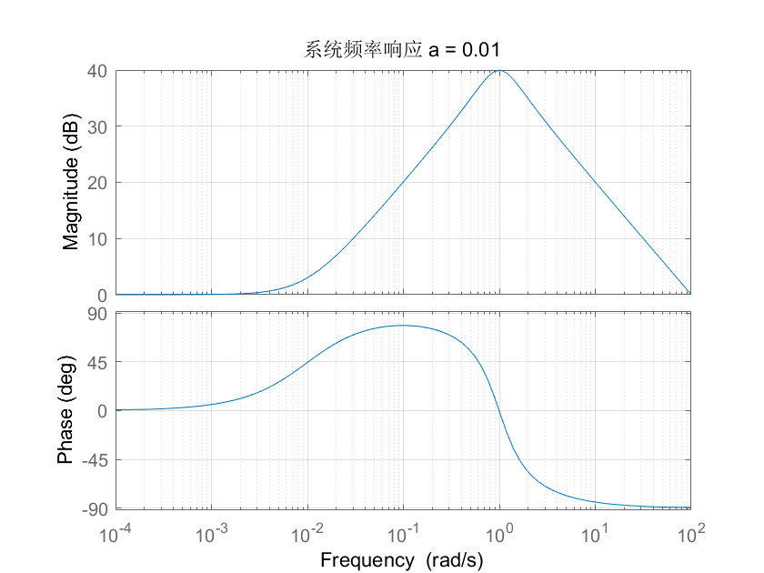
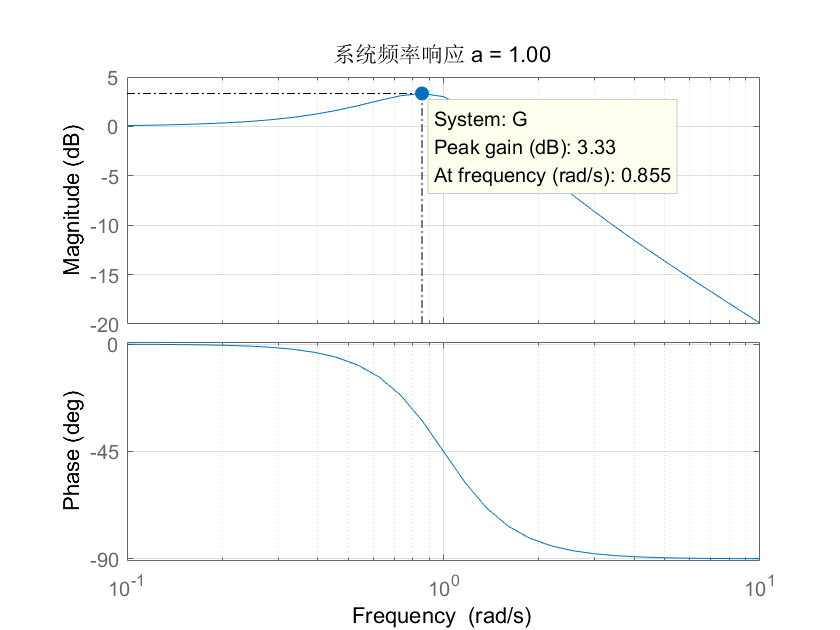

### 零极点对系统性能的影响

计64	嵇天颖	2016010308

计64    秦笑容

---

[TOC]

---

#### 一、实验目的

#### 二、实验要求

#### 三、实验内容

1. 当开环传递函数为`G1(s)`时，绘制系统的根轨迹和奈奎斯特曲线

   取`a = 1`

* 根轨迹曲线：

~~~matlab
k = 1; %开环增益
a = 1; 
num = [1/a 1];
den = [1 1 1];
[p,z] = pzmap(num,den);
G = zpk(z,p,k);
rlocus(G); 
title('系统G1(s)=(s/a+1)/(s^2+s+1)根轨迹图');
~~~

* 奈奎斯特曲线

~~~matlab
%G1,a= 1,奈奎斯特曲线
k = 1; %开环增益
a = 1; 
num = [1/a 1];
den = [1 1 1];
nyquist(num,den);
title('G1(s)= (s/a+1)/(s^2+s+1)的奈奎斯特曲线');
~~~

2 当开环传递函数为`G1(s)`时, `a`分别取 `0.01，0.1，1，10，100` 时，用 `Matlab `计算系统阶跃响应的超调量和系统频率响应的谐振峰值，并分析 两者的关系；

3.画出2中各个`a`值对应的波特图
$$
开环传递函数G(s) = \frac{s/a+1}{s^2+s+1}\\
闭环传递函数M(s) = \frac{s/a+1}{s^2+(1/a+1)s+2}
$$

* 系统阶跃响应

~~~matlab
% a = 0.01,0.1,1,10,100
a = 0.01;
num=[1/a,1]
den=[1,1/a+1,2]
step(num,den)
grid on
xlabel('t'),ylabel('c(t)')
title(sprintf('系统响应 a = %.2f',a));
~~~

* 系统频域响应

~~~matlab
% a = 0.01,0.1,1,10,100
a = 0.01;
num=[1/a,1] % num = [1/a,1]
den=[1,1,1] 
G=tf(num,den)                       
bode(G) 
grid on
title(sprintf('系统频率响应 a = %.2f',a));
~~~

* a = 0.01

$$
系统单位阶跃响应最大值y_m = 0.989\\
系统单位阶跃响应稳态值y_s = 0.5\\
系统单位阶跃响应超调量\sigma= \frac{y_m-y_s}{y_s}=\frac{0.989-0.5}{0.5}=0.978
$$

​		
$$
系统的谐振峰值是M_r = 40dB
$$

* a = 0.1

  

$$
系统单位阶跃响应最大值y_m = 0.89\\
系统单位阶跃响应稳态值y_s = 0.5\\
系统单位阶跃响应超调量\sigma= \frac{y_m-y_s}{y_s}=\frac{0.89-0.5}{0.5}=0.78
$$

$$
系统的谐振峰值是M_r = 20dB
$$

* a = 1

$$
系统单位阶跃响应最大值y_m = 0.604\\
系统单位阶跃响应稳态值y_s = 0.5\\
系统单位阶跃响应超调量\sigma= \frac{y_m-y_s}{y_s}=\frac{0.604-0.5}{0.5}=0.208
$$

$$
系统的谐振峰值是M_r = 3.33dB
$$

* a = 10

  
  $$
  系统单位阶跃响应最大值y_m = 0.634\\
  系统单位阶跃响应稳态值y_s = 0.5\\
  系统单位阶跃响应超调量\sigma= \frac{y_m-y_s}{y_s}=\frac{0.634-0.5}{0.5}=0.268
  $$
  

* a = 100

$$
系统单位阶跃响应最大值y_m = 0.65\\
系统单位阶跃响应稳态值y_s = 0.5\\
系统单位阶跃响应超调量\sigma= \frac{y_m-y_s}{y_s}=\frac{0.65-0.5}{0.5}=0.3
$$
